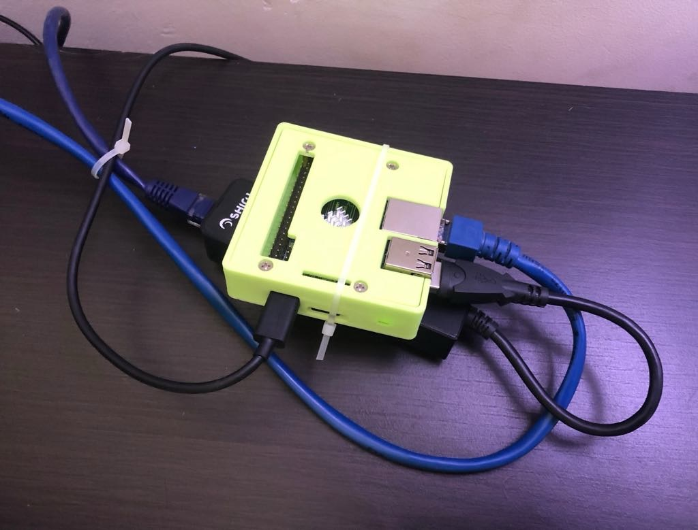
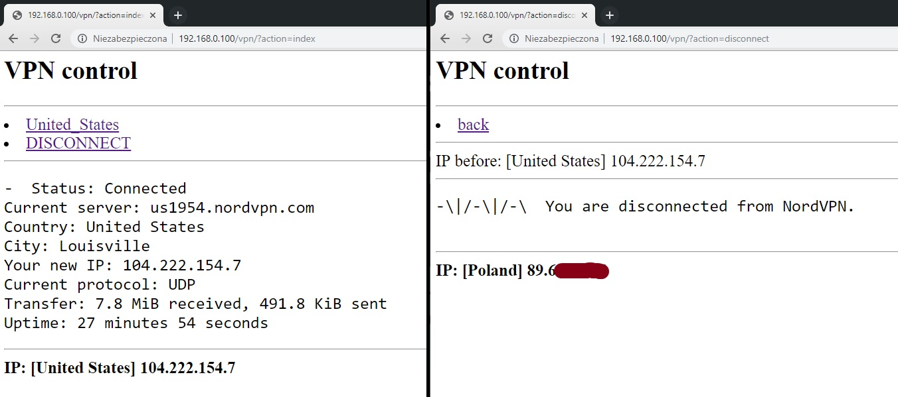

# nordvpn-on-webos-via-linux-box

Purpose of this project is to bypass country lock of content on Netflix or other streaming platforms using NordVPN service on any smart TV that does not have Android (like webOS on LG).

## Linux box

### Hardware
* It can by any linux device, especially Raspberry Pi like. In my case it's NanaoPi M1.
* We need 2 ethernet ports to plug it in between ethernet cable to TV
  * Since most small computers have only one we can use external network adapted connected via USB (should be able to provide 80-90mbps)

### Software

#### NordVPN binary
* https://support.nordvpn.com/Connectivity/Linux/1182453582/Installing-and-using-NordVPN-on-Linux.htm
* This will hard require non-root user
* To control nordvpn we can't just `su` - DBus is used there which won't work easily

### Router

#### Interfaces
We'll use following assumptions:
* `eth0` is downstream to real router, static IP is preferable
* `eth1` is port towards TV, using IP `10.0.0.1/24`
* `tun0` is spawned by nordvpn binary

To keep old names we need to add rules to `/etc/udev/rules.d/70-persistent-net.rules` like those (check MAC addr with `ip a`):

```
SUBSYSTEM=="net", ACTION=="add", DRIVERS=="?*", ATTR{address}=="02:81:61:85:5b:44", ATTR{dev_id}=="0x0", ATTR{type}=="1", KERNEL=="eth*", NAME="eth0"
SUBSYSTEM=="net", ACTION=="add", DRIVERS=="?*", ATTR{address}=="00:e0:4c:68:00:52", ATTR{dev_id}=="0x0", ATTR{type}=="1", KERNEL=="eth*", NAME="eth1"
```

Example IP configuration - `/etc/network/interfaces`:

```
auto lo
iface lo inet loopback

auto eth0
iface eth0 inet static
  address 192.168.0.100
  netmask 255.255.255.0
  network 192.168.0.0
  broadcast 192.168.0.255
  gateway 192.168.0.1
  dns-nameservers 8.8.8.8

auto eth1
iface eth1 inet static
  address 10.0.0.1
  netmask 255.255.255.0
```


#### Packet forwarding
Set `net.ipv4.ip_forward = 1` in `/etc/sysctl.conf`, then `sysctl -p /etc/sysctl.conf; service network restart`

#### Firewall

Rules:

```
iptables --table nat --append POSTROUTING --out-interface tun0 -j MASQUERADE
iptables --table nat --append POSTROUTING --out-interface eth0 -j MASQUERADE
iptables --append FORWARD --in-interface eth1 -j ACCEPT
```

Autorestore them - follow https://major.io/2009/11/16/automatically-loading-iptables-on-debianubuntu/

## TV
* No DHCP, hardcode IP address in settings
  * per assumprions from *router* section using `10.0.0.2/24`, DNS can be anything
* Leaving WiFi configured but disabled
  * it's easier to just shut it down rather than assume TV's routing will work as intended
  * Linux box will anyway route traffic even when VPN is disconnected
* I added WebUI as bookmark to TV home screen
  * but remember to use 10.0.0.1, no admin IP

## WebUI
* install apache and php
  * `apt install apache2 php libapache2-mod-php`
* drop index.php somewhere in DocumentRoot, easies way it to use one defined in `/etc/apache2/sites-enabled/000-default.conf`
* set `$TARGET_COUNTRY` in source or leave United_States

## Rest of hardware
* additional patchcord
* reliable USB power supply (USB port on TV will very likely kill power when it's in standby)

## Notes
* to check netflix content availability I recommend https://unogs.com

## Demo


